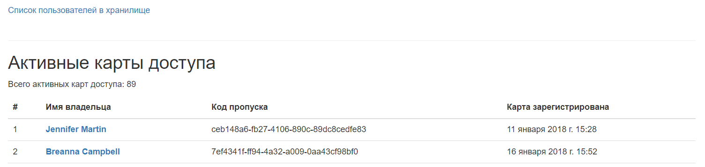
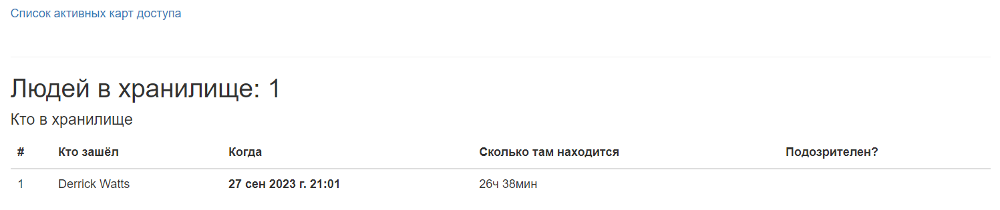

# Пульт охраны банка

Это внутренний репозиторий для сотрудников банка "Сияние". Если вы попли в это репозиторий случайно, то вы не сможете его запустить, т.к. у вас нет доступа к базе данных, но можете свободно использовать код верстки или посмотреть как реализованы запросы к базе данных. 

Пульт охраны - это сайт, который можно подключить к удаленной базе данных с визитами и карточками пропуска сотрудников нашего банка.

### Как установить
Python3 должен быть уже установлен. 
Затем используйте `pip` (или `pip3`, есть конфликт с Python2) для установки зависимостей:
```
pip install -r requirements.txt
```

Для работы сайта и подключения к базе данных (БД) необходимо создать файл `.env` в папке с проектом и задать в нем перменные окружения: 
- SECRET_KEY сайта
- DATABASE_HOST - адрес сервера БД
- DATABASE_PORT - порт сервера БД
- DATABASE_NAME - название БД
- DATABASE_USER - пользователь БД
- DATABASE_PASSWORD - пароль пользователя БД
- ALLOWED_HOSTS - cписок допустимых имен хостов

Запустите сайт из папки с проектом следующей командой:
```bash
python manage.py runserver 127.0.0.1:8000
```

### Пример работы сайта





### Цель проекта

Код написан в образовательных целях на онлайн-курсе для веб-разработчиков [dvmn.org](https://dvmn.org/).